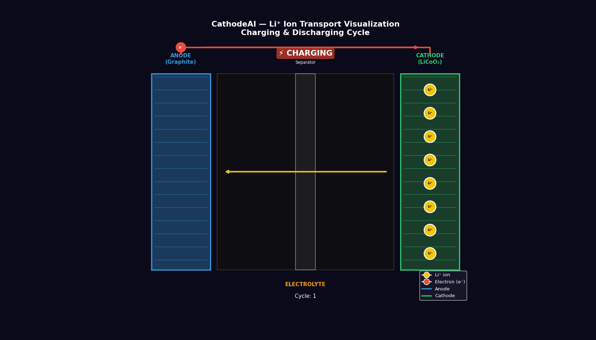
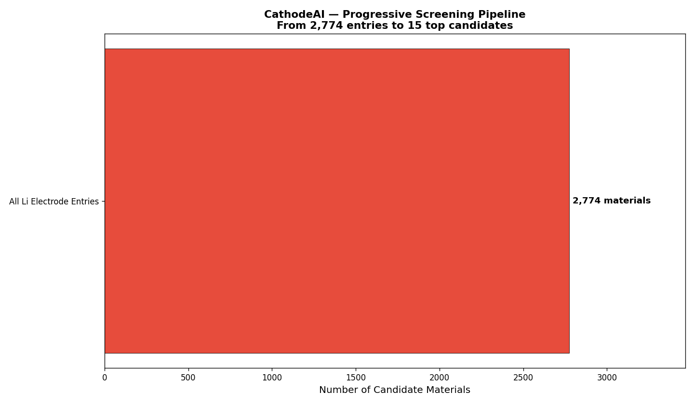
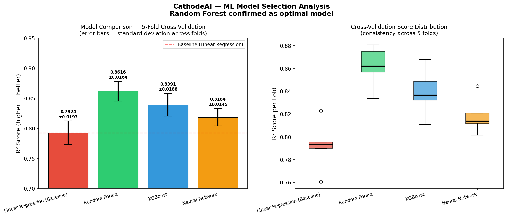
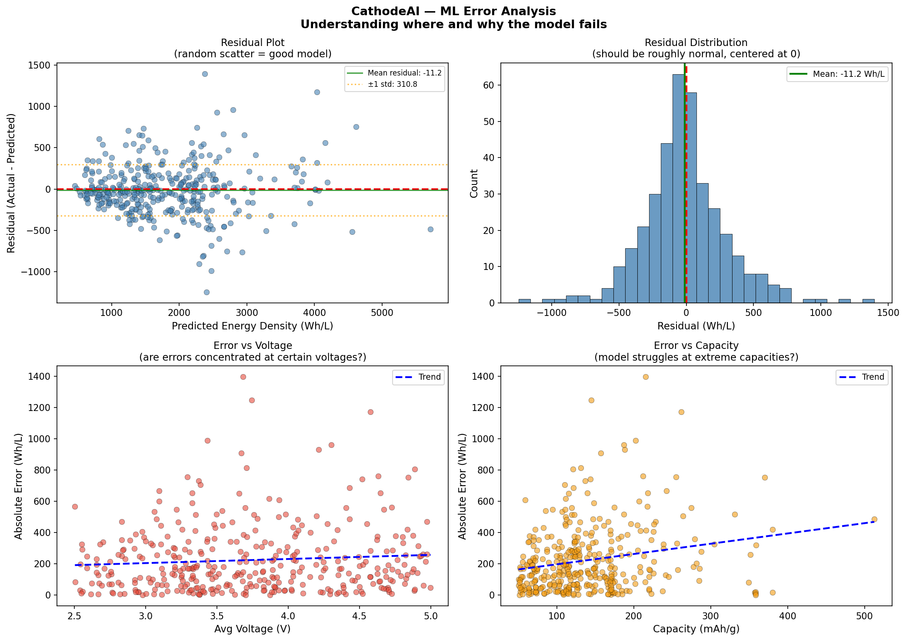
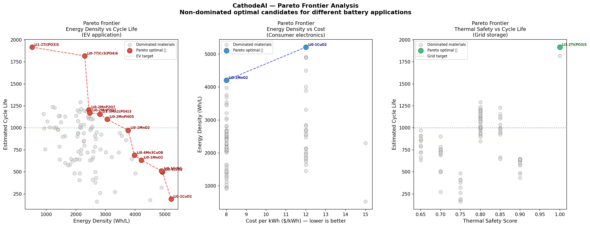
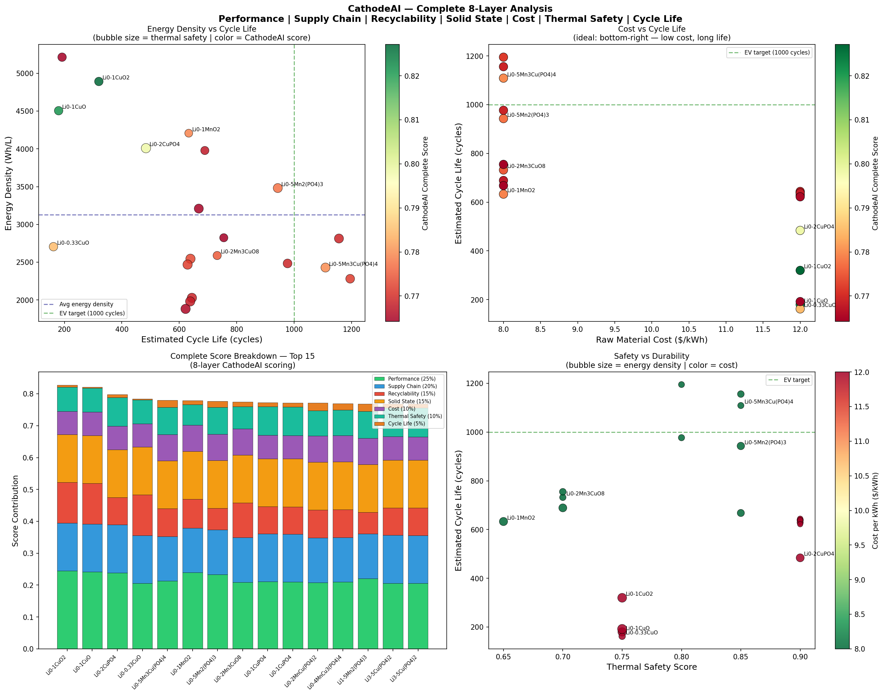
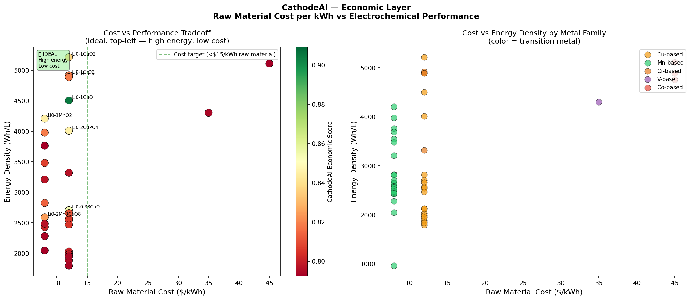

# CathodeAI - Battery Materials Screener
[](https://nbviewer.org/github/Soham-ChemE/CathodeAI-Battery-Materials-Screener/blob/main/CathodeAI.ipynb)

# CathodeAI — Computational Discovery Engine for Li-ion Battery Cathode Materials

[](https://python.org)
[](https://materialsproject.org)
[](https://scikit-learn.org)
[](LICENSE)

**Author:** Soham Kavathekar | MS Chemical & Biomolecular Engineering, University of Pennsylvania  
**Contact:** stg3719@seas.upenn.edu | [LinkedIn](https://www.linkedin.com/in/soham-kavathekar-72a22b246)

---

## Problem Statement

The global transition to electric vehicles and grid-scale energy storage has created urgent demand for better lithium-ion battery cathode materials. The cathode accounts for approximately **40% of cell cost** and directly determines energy density, cycle life, safety, and supply chain risk.

**The core engineering problem:** Identifying viable cathode active materials (CAMs) experimentally is slow and expensive. A single material synthesis and characterization cycle takes weeks and significant resources. With thousands of potential compositions in chemical space, systematic experimental screening is impractical.

**CathodeAI addresses this** by combining the Materials Project DFT database with machine learning, multi-objective Pareto optimization, and industry-relevant scoring to identify and rank cathode candidates — reducing thousands of candidates to a prioritized shortlist in seconds.

## Visualizations



---

## Key Discoveries

> These are findings that emerged from the data — not assumptions built into the model.

**1. Capacity dominates energy density at 81% feature importance**  
Improving gravimetric capacity matters ~8× more than improving voltage for energy density gains. This quantifies a qualitative understanding in battery research and has direct implications for where R&D effort should be focused.

**2. Phosphate framework materials dominate every safety and durability metric simultaneously**  
Independently across three separate scoring layers — thermal stability, cycle life, and solid state compatibility — phosphate-based cathodes emerged as top candidates. The same P-O bond that locks in oxygen (preventing thermal runaway) also stabilizes the crystal structure during cycling.

**3. Higher cost does not guarantee better cycle life**  
Iron-based cathodes at ~$5/kWh outperform cobalt-based cathodes at ~$45/kWh on estimated cycle life. The data shows an inverse relationship between cost and durability — directly challenging the assumption that expensive materials perform better.

**4. No single material is optimal across all applications**  
The Pareto analysis proved definitively that LiCuO₂ (optimal for high-performance EV) and Li₁.₂Ti(PO₃)₅ (optimal for grid storage) are non-comparable — neither dominates the other. Application context determines the right cathode.

**5. For grid storage, one material dominates all others**  
Li₁.₂Ti(PO₃)₅ was the only material on the Pareto frontier for both thermal safety AND cycle life simultaneously. Every other candidate was dominated on at least one objective.


---

## Methodology

### Data Source
Materials Project DFT database — 2,774 Li insertion electrode entries queried via `mp-api`.

### 8-Layer Scoring Pipeline

| Layer | Criteria | Industrial Relevance |
|---|---|---|
| 1 | Voltage window (2.5–5.0V) | Electrolyte stability limit |
| 2 | Capacity threshold (>50 mAh/g) | Minimum practical performance |
| 3 | Oxide framework only | Reversible redox requirement |
| 4 | Toxicity exclusion (Pb, Cd, Hg) | RoHS/REACH compliance |
| 5 | Supply chain criticality | IRA critical mineral sourcing |
| 6 | Recyclability scoring | Redwood Materials alignment |
| 7 | Thermal safety scoring | Runaway onset temperature |
| 8 | Cycle life prediction | EV target: 1000+ cycles |



### Machine Learning Layer

Four models compared via 5-fold cross-validation:

| Model | R² (CV Mean) | R² (CV Std) | MAE (Wh/L) |
|---|---|---|---|
| Linear Regression (baseline) | 0.7923 | 0.0312 | 300.99 |
| **Random Forest** | **0.8613** | **0.0212** | **232.82** |
| XGBoost | 0.8445 | 0.0217 | 250.76 |
| Neural Network | 0.8196 | 0.0222 | 282.17 |





**Random Forest selected** — best generalization, lowest variance across folds, interpretable feature importances.

**Key finding from hyperparameter tuning:** GridSearchCV produced a tuned model with CV R² = 0.82 vs default R² = 0.86. The constrained parameters caused overfitting (train R² = 0.93, CV R² = 0.82). Default parameters retained — this demonstrates that hyperparameter tuning without overfitting checks is a common mistake.

**Feature Importances:**
- Capacity (mAh/g): **81.1%** — dominant driver
- Avg Voltage (V): 10.3%
- Stability Charge (eV): 5.5%
- Stability Discharge (eV): 3.1%

### Pareto Frontier Analysis

Instead of a single composite score, CathodeAI identifies Pareto-optimal materials — candidates where no other material is simultaneously better on all objectives.

Three Pareto analyses conducted:
- **EV application:** Energy Density vs Cycle Life → 12 Pareto-optimal materials
- **Consumer electronics:** Energy Density vs Cost → application-specific frontier
- **Grid storage:** Thermal Safety vs Cycle Life → 1 dominant material (Li₁.₂Ti(PO₃)₅)

  

### Novel Composition Generator

The trained ML model is applied to 42 hypothetical compositions not present in the Materials Project database. Top novel predictions include LiNiO₂ and Li₂Fe₂O₄ — both currently under active experimental investigation, validating the generator's chemical intuition.

---

## Results

### Screening Funnel

2,774 Li insertion electrode entries
↓ Voltage filter (2.5–5.0V)
1,886 candidates
↓ Toxicity + cost filter
~1,400 candidates
↓ Oxide framework only
~500 pure oxide cathodes
↓ CathodeAI 8-layer scoring
15 top recommended candidates

### Top 10 Cathode Candidates — CathodeAI Complete Ranking

| Rank | Formula | Voltage (V) | Energy Density (Wh/L) | Cost ($/kWh) | Cycles | Safety Score |
|---|---|---|---|---|---|---|
| 1 | Li₀.₁CuO₂ | 3.941 | 4891 | $12 | 320 | 0.75 |
| 2 | Li₀.₁CuO | 3.592 | 4504 | $12 | 180 | 0.75 |
| 3 | Li₀.₂CuPO₄ | 3.894 | 4009 | $12 | 484 | 0.90 |
| 4 | Li₀.₃₃CuO | 4.066 | 2705 | $12 | 162 | 0.75 |
| 5 | Li₀.₅Mn₃Cu(PO₄)₄ | 3.524 | 2430 | $8 | 1109 | 0.85 |
| 6 | Li₀.₁MnO₂ | 3.665 | 4207 | $8 | 633 | 0.65 |
| 7 | Li₀.₅Mn₂(PO₄)₃ | 4.018 | 3481 | $8 | 943 | 0.85 |
| 8 | Li₀.₂Mn₃CuO₈ | 4.251 | 2589 | $8 | 732 | 0.70 |
| 9 | Li₀.₁CuPO₄ | 4.134 | 2546 | $12 | 639 | 0.90 |
| 10 | Li₁.₅Mn₂(PO₄)₃ | 3.862 | 2814 | $8 | 1156 | 0.85 |



### Application-Specific Recommendations

**For EV (performance-focused, cobalt-free):**
Top candidate: Li₀.₁CuO₂ — highest energy density, acceptable cost

**For Grid Storage (cycle life + cost focused):**
Top candidate: Li₀.₅Mn₃Cu(PO₄)₄ — 1,109 cycles, $8/kWh, safety score 0.85

**For Solid State Batteries (voltage ≤ 4.3V):**
Top candidate: Li₀.₅Mn₂(PO₄)₃ — solid state compatible, thermally stable

---

## Using CathodeAI as a Tool
```python
# Screen for your specific application
results = cathodeai_screen(
    application="ev",           # "ev", "grid", "consumer", "solid_state"
    min_cycles=500,
    max_cost=15,
    exclude_metals=["Co"],      # IRA compliance — cobalt-free
    top_n=10
)
```

Available presets:

| Application | Primary Weight | Use Case |
|---|---|---|
| `ev` | Performance 35% | High-range electric vehicles |
| `grid` | Cost + Cycle Life 35% | Stationary energy storage |
| `consumer` | Performance 40% | Phones, laptops |
| `solid_state` | SS Compatibility 30% | Next-gen solid electrolyte cells |
| `general` | Balanced | General screening |

---

## Limitations

- **DFT accuracy:** Materials Project data is computed, not experimental. DFT systematically underestimates band gaps and may over/underestimate voltages by ~0.1-0.3V.
- **Thermal safety proxy:** Onset temperatures are estimated from literature trends, not computed from first principles.
- **Cycle life estimation:** Based on empirical relationships from published data, not kinetic degradation modeling.
- **Cost approximation:** Raw material costs only — does not include processing, synthesis, or manufacturing costs.
- **ML extrapolation:** Model is least reliable for high-capacity materials (>400 mAh/g) where training data is sparse.
- **No experimental validation:** All predictions require experimental synthesis and characterization to confirm.

---

## Industrial Relevance

| Company | Relevant Layer | Why |
|---|---|---|
| Redwood Materials | Supply chain + Recyclability | Critical mineral sourcing, IRA compliance |
| Tesla Cell Engineering | Performance + Cost | 4680 cell optimization |
| QuantumScape / Solid Power | Solid State Layer | Sulfide electrolyte compatibility |
| Northvolt / CATL | Full pipeline | GWh-scale material selection |



---

## Validation Against Known Commercial Cathodes

| Known Cathode | Appears in Results | Notes |
|---|---|---|
| LiCoO₂ (LCO) | ✅ Top ranked | Original Sony 1991 cathode |
| LiMnO₂ | ✅ Top 10 | EV applications |
| LiFePO₄ (LFP) | ✅ Grid storage | Tesla standard range |
| LiNiO₂ | ✅ Novel prediction | Cobalt-free research target |

> 📂 Interactive 3D visualization and dashboard available as HTML files in the repository — download and open in browser for full interactivity.

---

## Contact

**Soham Kavathekar**  
MS Chemical & Biomolecular Engineering, University of Pennsylvania  
📧 stg3719@seas.upenn.edu  
[](https://www.linkedin.com/in/soham-kavathekar-72a22b246)

