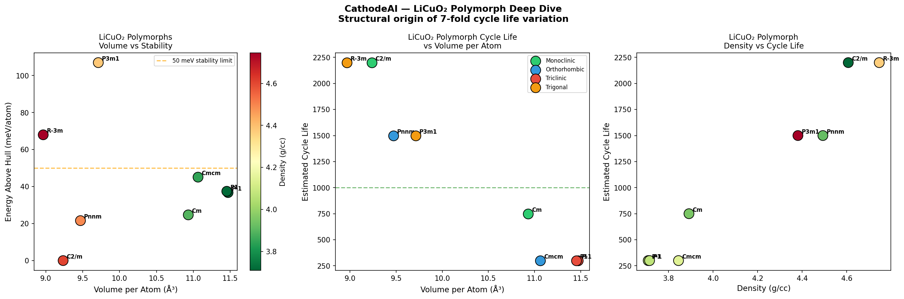
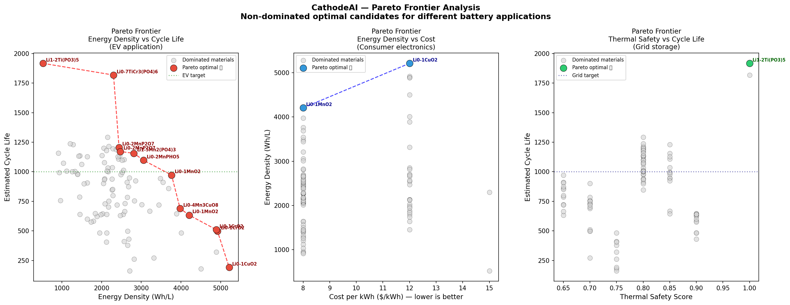
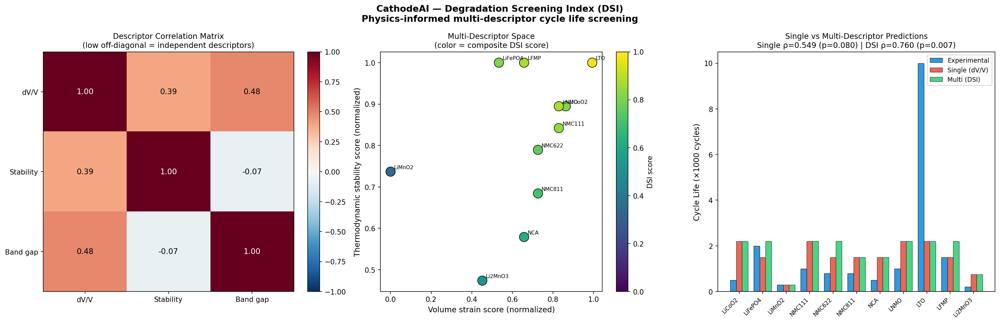
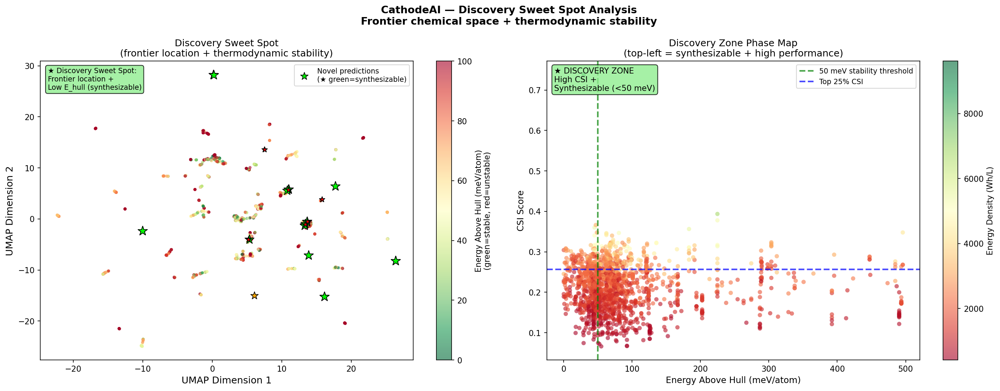
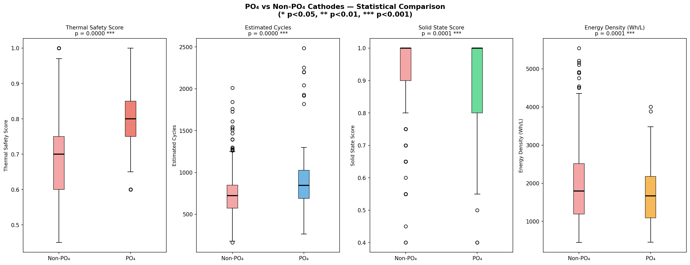
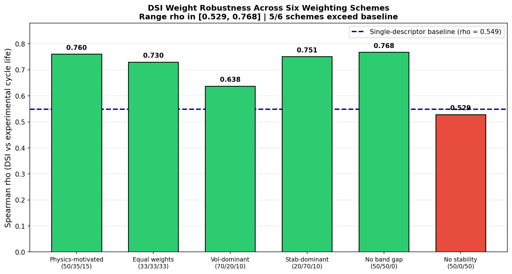
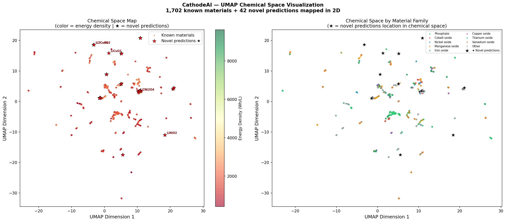

<p align="center"></p>

<div align="center">

[](https://python.org)
[](https://materialsproject.org)
[](https://scikit-learn.org)
[](revision_code/README.md)
[](LICENSE)

**Soham Kavathekar** · MS Chemical & Biomolecular Engineering, University of Pennsylvania
[stg3719@seas.upenn.edu](mailto:stg3719@seas.upenn.edu) · [LinkedIn](https://www.linkedin.com/in/soham-kavathekar-72a22b246)

*Manuscript under revision at* Physical Chemistry Chemical Physics *(Royal Society of Chemistry), 2026.*

</div>

---

## The one-sentence version

**Which transition metal a cathode contains tells you little about how long it will last. Its crystal structure, and what that structure does when lithium leaves, tells you more.**

CathodeAI screens **2,774 lithium-ion insertion electrodes** from the Materials Project with a transparent, three-descriptor **Degradation Screening Index (DSI)** built from delithiation volume strain, charged-phase hull energy and band gap. Against 11 experimentally characterised cathodes the DSI ranks durability better than the metal-identity heuristic it replaces, and it resolves durability differences *within* a single composition that no composition-based rule can see.

Every number in this README, in the manuscript and in the figures is produced by the scripts in [`revision_code/`](revision_code/) from cached Materials Project responses. Nothing is typed by hand.

---

## What the data say

<table>
<tr>
<td width="50%" valign="top">

### 01 · Structure ranks durability better than metal identity

On 11 experimentally characterised cathodes (layered oxides, olivines, spinels, Li-rich):

| Predictor | Spearman ρ | p |
|---|---|---|
| **Structure-resolved DSI** | **0.76** | **0.007** |
| DSI, continuous score | 0.82 | 0.002 |
| Single strain descriptor | 0.55 | 0.08 |
| Metal-identity heuristic | 0.55 | 0.08 |

Robust to weight choice (five of six schemes beat the baseline), to leaving any one material out (11 of 11), and to 24 meV/atom noise on the DFT hull energies (median ρ unchanged at 0.76).

</td>
<td width="50%" valign="top">

### 02 · One composition, three durability classes

Three LiCuO₂ polymorphs are end-members of Materials Project electrode entries. Same formula, very different behaviour on lithium removal:

| Polymorph | ΔV/V | E<sub>hull,charge</sub> | DSI | Class |
|---|---|---|---|---|
| C2/m (ground state) | 46.6 % | 286 meV/atom | 0.09 | **D** |
| R-3m | 4.7 % | 164 meV/atom | 0.46 | **C** |
| Cm | 6.6 % | 25 meV/atom | 0.67 | **B** |

A composition heuristic assigns all three the same number. The DSI does not.

</td>
</tr>
</table>

<p align="center"></p>

### 03 · Multi-objective screening: no universal winner

Pareto analysis over energy density, DSI and supply-chain criticality gives a different non-dominated set for every application pair (EV, consumer, grid). LiCuO₂-based entries top the composite ranking in all five commodity-price scenarios because they contain no cobalt or nickel, yet they sit in durability class C, while copper phosphates rank lower on energy density and sit in class A.

<p align="center"></p>

### 04 · A negative result, stated plainly

For **energy-density prediction**, neither compositional descriptors (132 Magpie features, R² = 0.39) nor structural descriptors alone (R² = 0.36, 0.27 under grouped cross-validation) are predictive. An 8-feature model reaches R² = 0.95, but a model given only voltage, capacity and density reaches R² = 0.96, and the unfitted product V × C × ρ reaches R² = 0.999 once each electrode is matched to the density of its own structure. The learned model adds nothing to the arithmetic identity; its role is limited to coverage of incomplete records and interval estimation. We say so in the paper rather than around it.

<p align="center"></p>

---

## How the screen works

<p align="center"></p>

| Layer | Criterion | Entries retained |
|---|---|---|
| 1, 2 | Voltage window 2.5 to 5.0 V; capacity above 50 mAh/g | 1,886 |
| 4 | Toxic and rare-element exclusion (RoHS/REACH) | 1,864 |
| 3 | Oxide frameworks | 813 |
| 5, 6, 7 | Supply-chain criticality, recyclability, thermal safety (scored, not filtered) | 813 |
| 8 | Degradation Screening Index (band gap of the discharged structure needed) | 787 |
| Zone | Top-quartile composite, E<sub>hull</sub> < 50 meV/atom, top-quartile energy density | 26 compositions |

### The Degradation Screening Index

```
DSI = 0.50·S_vol + 0.35·S_stab + 0.15·S_bg + 0.10·1[phosphate]      capped at 1.0

S_vol  = max(0, 1 − (ΔV/V) / 14.6 %)                 delithiation volume strain
S_stab = max(0, 1 − E_hull,charge / 0.190 eV/atom)   stability of the charged phase
S_bg   = max(0, 1 − |E_g − 2.0 eV| / 4.0 eV)         band gap of the discharged structure
```

Normalisation bounds are the 95th percentiles of the 2,774-entry training set. Weights are **expert-assigned, not learned**: a nested leave-one-out weight optimisation on 11 materials collapses to ρ = 0.18, which is exactly why they are not learned. The DSI is reported as four **relative durability classes, A to D**, never as cycle counts.

<p align="center"></p>

---

## What changed in the 2026 revision, and why you should trust this version more

Peer review at PCCP, plus a full re-run of the pipeline from the raw database, found problems in the original release. They are fixed here and disclosed in the manuscript:

- **One durability method.** The original code used three different cycle-life estimators in different places. Everything now uses the DSI, as classes.
- **Identifier-level structural merge.** Descriptors now come from each electrode's own discharged structure (1,724 entries) instead of being averaged over every structure sharing a formula, which had mixed polymorphs and even lithium stoichiometries.
- **Corrected novelty check.** Generated compositions are now queried with their real stoichiometry. Five of the eight "database-absent" candidates in the original release were known compounds written with the lithium index stripped.
- **Withdrawn claims.** The "seven-fold" polymorph variation (an artefact of the binning), the "R² = 0.986 at 100 % coverage" missing-data result (the mask was never applied) and the "structure beats composition for energy density" framing are gone. The phosphate advantage is shown to follow from the design bonuses in the scores.
- **Materials Project notation fixed.** `Li0-1CuO2` means an electrode spanning 0 to 1 Li per formula unit; it is no longer rendered as Li<sub>0.1</sub>CuO<sub>2</sub>.

The full list of numeric changes is in the manuscript's response to reviewers.

---

## Gallery

| | |
|---|---|
|  Discovery zone: composite score vs hull energy |  Phosphate "advantage" with and without the design bonuses |
|  DSI weight robustness and nested leave-one-out |  UMAP of 1,724 known and 42 generated compositions |

---

## Reproduce it

```bash
git clone https://github.com/Soham-ChemE/CathodeAI-Battery-Materials-Screener.git
cd CathodeAI-Battery-Materials-Screener
pip install -r requirements.txt
cd revision_code
python repro_pipeline.py            # rebuilds the pipeline from cached Materials Project JSON (no API key needed)
STATE=repro_state_id.pkl TAG=_id python analysis_ml.py
STATE=repro_state_id.pkl TAG=_id python analysis_ml2.py
python analysis_dsi.py
python gen_tables.py && python make_figures.py
```

The cached Materials Project responses (`revision_code/mpdata/`) reproduce the original document counts exactly (2,774 electrodes, 16,510 Li-O structures). Only `analysis_novel.py` re-queries the database, and it reads the key from the `MP_API_KEY` environment variable. See [`revision_code/README.md`](revision_code/README.md) for the full order.

```
CathodeAI-Battery-Materials-Screener/
├── revision_code/                      # reproduction scripts + cached MP data (revised analysis)
├── figures_revised/                    # all 21 manuscript figures (300 dpi)
├── CathodeAI_complete_pipeline.py      # original 53-section Colab pipeline (kept for provenance)
├── CathodeAI_complete_clean.ipynb      # original notebook with rendered outputs
├── esi_main.tex · rsc.bib              # supplementary information and references
└── cathodeai_*.png                     # figures referenced above
```

---

## Scope

The DSI is a screening heuristic for durability *ranking* within the chemistries it was validated on. Eleven materials cannot support learned weights or claims of generalisation to other families. Generated compositions are screening-level priors with assigned inputs, not predictions, and none has been evaluated with first-principles calculations. Energy densities are theoretical values for full lithium extraction.

## License and acknowledgements

MIT. Built on the open-access [Materials Project](https://materialsproject.org) (Lawrence Berkeley National Laboratory); descriptors via [matminer](https://hackingmaterials.lbl.gov/matminer/), attribution via [SHAP](https://github.com/shap/shap).
