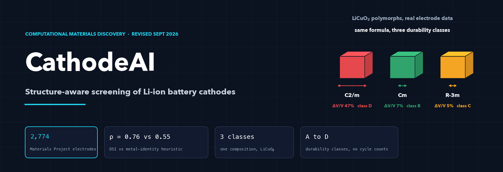
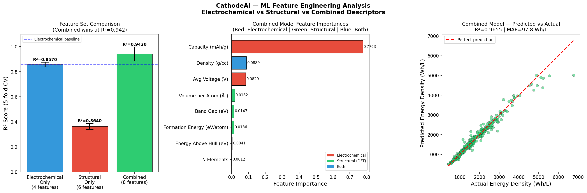
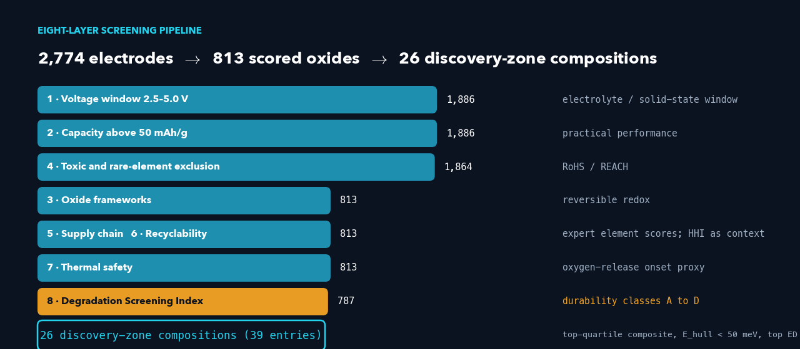
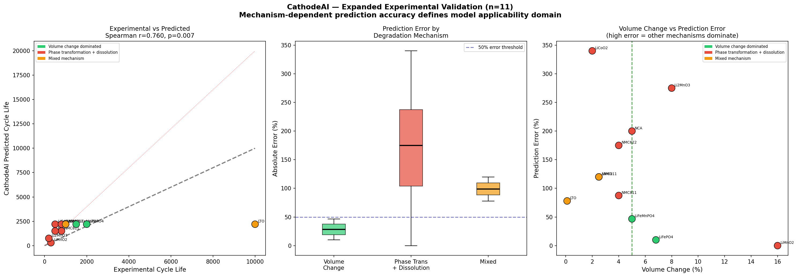

<div align="center">

[](https://python.org)
[](https://materialsproject.org)
[](https://scikit-learn.org)
[](LICENSE)

**Soham Kavathekar** · MS Chemical & Biomolecular Engineering, University of Pennsylvania
[stg3719@seas.upenn.edu](mailto:stg3719@seas.upenn.edu) · [LinkedIn](https://www.linkedin.com/in/soham-kavathekar-72a22b246)

</div>

---

## The one-sentence version

**Which transition metal a cathode contains tells you surprisingly little about how it will behave. Its crystal structure tells you much more.** CathodeAI screens 2,774 lithium-ion insertion electrodes from the Materials Project and shows, across four independent lines of evidence, that structure-derived descriptors outperform composition-level heuristics for cathode screening.

This is a scientific finding, not a software demo. The framework is a **screening and prioritization tool** that reduces thousands of candidates to a defensible shortlist, with every claim traceable to a reproducible pipeline.

---

## Four lines of evidence

| | Finding | Evidence |
|---|---------|----------|
| **01** | **Composition heuristics reach a predictive limit.** | Metal-identity cycle-life heuristics show essentially no correlation with structure-based degradation indicators (Pearson **r = 0.151**). Identical LiCuO₂ compositions vary **~7-fold** in predicted durability across crystal polymorphs (a 28% spread in volume per atom). |
| **02** | **Structure improves property prediction.** | Eight physics-informed structural features reach **R² = 0.942** for volumetric energy density, versus **R² = 0.413** for 83 Lasso-selected compositional descriptors. Compositional feature spaces saturate; structure-grounded ones do not. |
| **03** | **Structure improves degradation ranking.** | A transparent, structurally-grounded Degradation Screening Index ranks experimental durability at **Spearman ρ = 0.760** (p = 0.007) vs **ρ = 0.549** (p = 0.080, not significant) for a single volume-strain descriptor, across 11 well-characterized cathodes. |
| **04** | **Multi-objective screening changes outcomes.** | Pareto analysis over energy density, stability and supply-chain criticality shows **no single material is universally optimal**; each application has its own frontier. |

The conclusion is model-agnostic. It is about *which descriptors carry the signal*, not about a particular machine-learning algorithm.



> Structure-informed features (8) reach R² = 0.942 for energy-density prediction, outperforming 83 purely compositional descriptors (R² = 0.413).

---

## How the screen works



Eight sequential layers reduce 2,774 candidates to a prioritized shortlist. Each layer encodes a real physicochemical or industrial constraint.

| Layer | Criterion | Why it matters |
|---|---|---|
| 1 | Voltage window (2.5-5.0 V) | Electrolyte stability / high-voltage solid-state |
| 2 | Capacity ≥ 50 mAh/g | Minimum practical performance |
| 3 | Oxide framework | Reversible intercalation redox |
| 4 | Toxicity exclusion (Pb, Cd, Hg) | RoHS / REACH compliance |
| 5 | Supply-chain criticality (HHI + IRA) | Sourcing risk |
| 6 | Recyclability | Hydrometallurgical recovery |
| 7 | Thermal safety | Oxygen-release onset proxy |
| 8 | Degradation Screening Index | Structure-aware durability ranking |

---

## Headline results

Every value below is produced by running the notebook end-to-end.

**Machine learning: volumetric energy density (Wh/L)**

Feature-set comparison (5-fold CV, Random Forest):

| Feature set | R² (mean) | R² (std) | # features |
|---|---|---|---|
| Electrochemical only | 0.857 | 0.019 | 4 |
| Structural only (DFT) | 0.364 | 0.024 | 6 |
| **Combined (final)** | **0.942** | **0.056** | **8** |
| MatMiner (Magpie) | 0.413 | 0.016 | 132 |
| Lasso-selected | 0.413 | 0.017 | 83 |
| Full (combined + MatMiner) | 0.937 | 0.055 | 140 |

Model comparison on the combined 8-feature set (5-fold CV):

| Model | R² (mean) | R² (std) | MAE (Wh/L) |
|---|---|---|---|
| Linear Regression | 0.930 | 0.015 | 153.99 |
| **Random Forest (selected)** | **0.942** | **0.056** | **101.97** |
| XGBoost | 0.945 | 0.046 | 104.28 |
| Neural Network | 0.976 | 0.010 | 84.46 |

> **On model choice (deliberate, not an oversight).** The neural network attains the highest cross-validation R². Random Forest was selected as the production model because its native impurity importances and exact TreeSHAP attribution are essential to the interpretability analysis at the core of this work and the accuracy gap (0.034 in R²) is small relative to prediction uncertainty. Held-out test performance for the final model: **R² = 0.966, MAE = 92.9 Wh/L**.

**Interpretability (SHAP).** Capacity dominates energy-density prediction (mean |SHAP| = 602 Wh/L; RF impurity importance ≈ **78.5%**), consistent with the thermodynamic definition of volumetric energy density. A useful sanity check that the model learned the physics rather than a spurious correlation.

**Degradation Screening Index (DSI)**
- Spearman ρ = **0.760** (p = 0.007); single-descriptor baseline ρ = 0.549 (p = 0.080, not significant)
- Binary screening accuracy **90.9%** (10/11 correctly classified)
- Robust across six weighting schemes (ρ ∈ [0.529, 0.768]) and all 11 leave-one-out iterations
- Descriptors near-independent on the full dataset (ΔV/V vs delithiated-phase E_hull: r = −0.005, n = 2,035)

**Uncertainty quantification (RF ensemble)**
- Empirical 95% prediction-interval coverage: **95.6%** (well-calibrated)
- Mean uncertainty ±308 Wh/L; uncertainty rises with capacity (r = 0.555), reflecting sparser training data in the high-capacity regime

**Screening & discovery**
- 2,774 entries → **12-15** high-value discovery-zone candidates
- 42 charge-balanced hypothetical compositions generated; **27/42** pass the synthesizability screen; **8** are genuinely absent from the Materials Project database (API-verified)
- LiCuO₂-based compositions hold top composite ranking across all **5** commodity-price scenarios

---

## The Degradation Screening Index

A transparent composite of three structure-derived descriptors, each tied to an independent degradation pathway:

```
DSI = 0.50·S_strain + 0.35·S_stability + 0.15·S_bandgap + 0.10·1_phosphate   (capped at 1.0)
```

The **weights are expert-assigned, not learned**. The DSI is presented honestly as a structurally-grounded *screening heuristic* whose advantage over composition-based heuristics is that it operates on structure-resolved state variables. Its value is demonstrated empirically (rank-order agreement with experiment), not asserted mechanistically. Normalization bounds are fixed on the training distribution, independent of the validation set.



> The multi-descriptor DSI (Spearman ρ = 0.760) ranks experimental cycle life across 11 cathodes better than a single volume-strain descriptor (ρ = 0.549).

---

## Reproducing the results

```bash
git clone https://github.com/Soham-ChemE/CathodeAI-Battery-Materials-Screener.git
cd CathodeAI-Battery-Materials-Screener
pip install -r requirements.txt
```

1. Get a free Materials Project API key: https://materialsproject.org/api
2. Set it as an environment variable: `export MP_API_KEY="your_key_here"`
3. Run the pipeline sections in order (designed as sequential Colab cells).

The pipeline is 53 numbered, self-contained sections: setup, screening layers, ML, interpretability, DSI validation.

```
CathodeAI-Battery-Materials-Screener/
├── CathodeAI_complete_pipeline.py      # Full 53-section pipeline (Colab-ready)
├── CathodeAI_complete_clean.ipynb      # Notebook with rendered outputs
├── cathodeai_*.png                     # Generated figures
├── requirements.txt
└── LICENSE
```

---

## Scope

The DSI is a structure-aware screening heuristic for durability *ranking*, validated on rank order across the major cathode structural classes rather than on absolute cycle counts. It is most reliable in the volume-change-dominated regime. The generated compositions are exploratory screening candidates that flag where to look next, not first-principles-validated materials. Energy-density values are theoretical. Full validation detail, robustness analyses and accompanying limitations are documented in the manuscript.

---

## Related work

A manuscript describing this framework in full, including the complete DSI validation, bootstrap and leave-one-out analyses and the heuristic-invalidation result, is in preparation. This repository contains the complete, runnable pipeline behind it.

## License

MIT. See [LICENSE](LICENSE).

## Acknowledgements

Built on the open-access [Materials Project](https://materialsproject.org) DFT database (Lawrence Berkeley National Laboratory). Descriptor generation uses [matminer](https://hackingmaterials.lbl.gov/matminer/); interpretability uses [SHAP](https://github.com/shap/shap).
